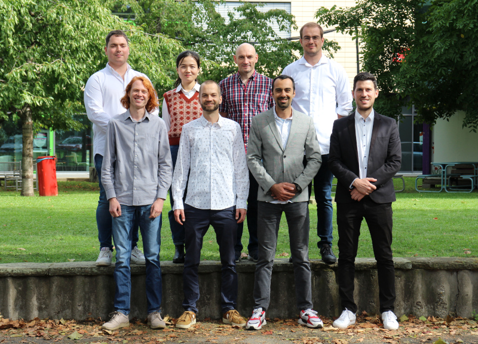

# Research Group Intelligent Systems

### About
Founded by Prof. Wasenmüller in 2021, our group of eight interdisciplinary members excels in electrical engineering, mechatronics, and computer science. Situated within the Research and Transfer Center CeMOS and the Faculty of Electrical Engineering at HSMA, we are committed to pioneering solutions in AI, computer vision, automotive, and medical technology through both fundamental and application-oriented research. Supported by grants from the DFG and BMBF, we leverage cutting-edge resources, including NVidia Deep Learning Servers, a robotic dog, and a state-of-the-art data acquisition vehicle.

<!--
### Projects
* ...
-->

### Publications
See [Google Scholar](https://scholar.google.de/citations?user=GkHxKY8AAAAJ&hl=de)

### Team

<!--

**Here are some ideas to get you started:**

🙋‍♀️ A short introduction - what is your organization all about?
🌈 Contribution guidelines - how can the community get involved?
👩‍💻 Useful resources - where can the community find your docs? Is there anything else the community should know?
🍿 Fun facts - what does your team eat for breakfast?
🧙 Remember, you can do mighty things with the power of [Markdown](https://docs.github.com/github/writing-on-github/getting-started-with-writing-and-formatting-on-github/basic-writing-and-formatting-syntax)
-->
